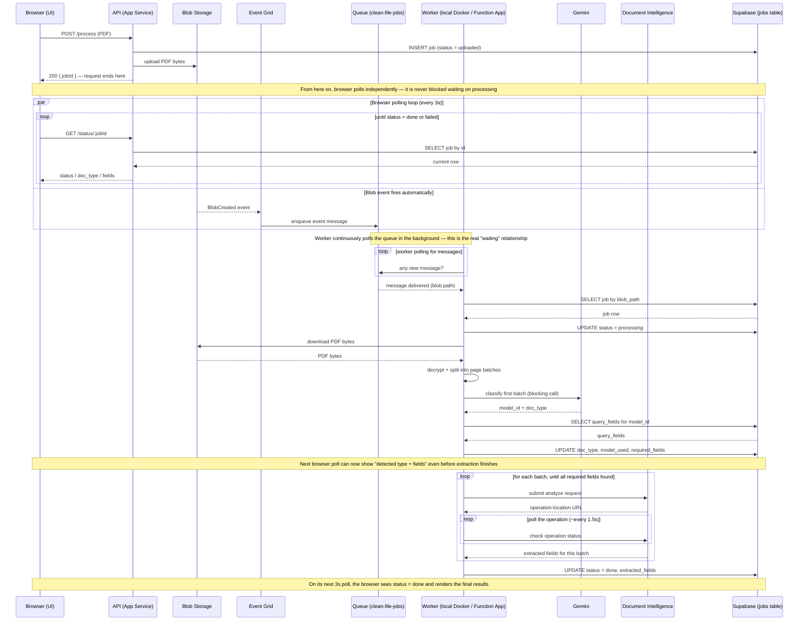

# Architecture

This document explains every moving part of the project, how they connect, and why each piece exists. It's written for someone who has never seen this codebase before.

## 1. The big picture

The system takes an uploaded PDF, figures out what type of document it is, extracts specific fields from it, and reports the result — but it does this **asynchronously**, using cloud infrastructure to handle the security scanning and processing rather than doing everything inside a single web request.

There are three deployable pieces:

| Piece | What it is | Where it runs |
|---|---|---|
| **API** | Express app — accepts uploads, reports job status | Azure App Service |
| **Worker** | Background processor — does the actual PDF/AI work | Azure Function App (custom Docker container) |
| **Database** | Job records and results | Supabase (hosted Postgres) |

They never call each other directly. They're connected entirely through **Azure Blob Storage** and an **Azure Storage Queue** — the API drops a file in storage, an event fires, a message lands on a queue, and the worker picks it up whenever it's ready. This means the API can return instantly instead of making the user wait for processing to finish.

## 2. Full request lifecycle, step by step

1. **User submits a PDF** through the frontend (`public/index.html` / `public/app.js`) — no manual field entry required; extraction fields are now determined automatically.
2. **API (`routes/documentRoutes.js`, `POST /process`)**:
   - Creates a row in Supabase's `jobs` table with `status: 'uploaded'`.
   - Uploads the raw PDF bytes to Blob Storage, into the `documents-incoming` container, under a random UUID filename.
   - Immediately responds to the browser with `{ jobId, status: 'uploaded' }`. This request is finished — nothing further happens on this HTTP connection.
3. **Blob Storage** now holds the file. Because a blob was created, it automatically emits a `Microsoft.Storage.BlobCreated` event.
4. **Event Grid** is subscribed to that event on this storage account. It forwards the event as a message onto the Storage Queue (`clean-file-jobs`). *(Note: this step is meant to sit behind a malware-scan gate — see Section 6.)*
5. **The Worker (`doc-worker/`)** — an Azure Function running inside a Docker container — has a queue-triggered function (`processUpload.js`) that wakes up the moment a message appears:
   - Parses the blob's container/filename out of the event.
   - Looks up the matching row in Supabase by `blob_path` (this is how the worker knows *which* job this blob belongs to — the event itself carries no job ID).
   - Downloads the actual PDF bytes from Blob Storage, decrypts if needed, splits into page batches.
   - Classifies the document **once**, using the first batch, via **Gemini** (`services/geminiClassifier.js`) — Gemini is constrained to return only one of a known set of Document Intelligence model IDs (sourced from Supabase's `document_models` table), falling back to `prebuilt-layout` if nothing matches confidently.
   - Looks up which fields to extract for that model from `document_models` (`services/modelLookupService.js`), and writes `doc_type`, `model_used`, and `required_fields` back to the job row **before** extraction finishes — this lets the UI show "here's what we're pulling out of this document" while it's still working.
   - Runs Document Intelligence's extraction model against each batch in turn, merging fields and **stopping early** once every required field has been found.
   - Writes the final result back to the same Supabase row: `status: 'done'`, extracted fields, page counts.
6. **The frontend**, which has been polling `GET /status/:jobId` every few seconds since step 2, updates its display as `required_fields` appears mid-processing, then renders the full results table once `status: 'done'`.

### Sequence diagram

This shows exactly who waits on whom — in particular, that the browser's polling loop and the worker's queue-polling loop run independently and only ever meet through the shared `jobs` row in Supabase.



## 3. Component-by-component reference

### API (Express app — repo root)

| File | Purpose |
|---|---|
| `server.js` | Entry point. Sets up Express, CORS, static file serving for the frontend, mounts routes. |
| `routes/documentRoutes.js` | `POST /process` (upload) and `GET /status/:jobId` (poll). No PDF processing happens here — and as of the Gemini rewrite, no field input either. |
| `services/blobService.js` | Uploads a buffer to Blob Storage. |
| `services/supabaseClient.js` | Shared Supabase client, used to create/read job rows. |
| `public/index.html`, `public/app.js` | Frontend — file upload, polling loop, an in-progress state showing detected type + planned fields, and the final results table. Served directly by the API via `express.static('public')`. |

### Worker (`doc-worker/` — separate deployable)

| File | Purpose |
|---|---|
| `src/functions/processUpload.js` | The queue-triggered function. Parses the blob-created event, finds the job in Supabase, classifies once via Gemini, looks up fields, runs extraction, writes the result. Contains two polyfills at the top of the file — see Section 5. |
| `services/decryptService.js` | Strips PDF encryption via the `qpdf` CLI. Treats qpdf's "succeeded with warnings" exit code (3) as success, not failure. |
| `services/pdfService.js` | Splits a PDF into N-page batches using `pdf-lib`. |
| `services/azureClient.js` | Talks to Azure AI Document Intelligence for field extraction (`analyzeWithModel`), with retry/backoff on 429 rate limiting. Reads its endpoint/key lazily so a missing env var can't crash function discovery. |
| `services/geminiClassifier.js` | Classifies a document via Gemini, constrained by a structured-output schema to only return a known `model_id` (sourced from Supabase's `document_models` table) or the fallback. |
| `services/modelLookupService.js` | Given a `model_id`, fetches its `query_fields` from `document_models`. |
| `config/modelRouting.js` | Now just holds `PAGES_PER_BATCH` — model routing itself lives in Supabase, not in code. |
| `Dockerfile` | Builds the container this Function App actually runs. Installs `qpdf` via `apt-get` and copies the code in. |

### Database (Supabase)

**`jobs`** — one row per upload:

```sql
create table jobs (
  id uuid primary key default gen_random_uuid(),
  status text not null default 'uploaded',       -- uploaded | processing | done | failed
  blob_path text not null,
  required_fields jsonb not null,                -- populated by the worker after classification
  extracted_fields jsonb,
  doc_type text,
  model_used text,
  total_pages int,
  pages_processed int,
  error text,
  created_at timestamptz not null default now(),
  updated_at timestamptz not null default now()
);
```

**`document_models`** — the routing table Gemini and the extraction step both read from:

```sql
create table document_models (
  id uuid primary key default gen_random_uuid(),
  doc_type text not null unique,
  model_id text not null unique,
  query_fields jsonb not null default '[]'::jsonb,
  is_fallback boolean not null default false,
  created_at timestamptz not null default now()
);
```

Both the API and the worker talk to these tables using the Supabase **service role key**, which bypasses row-level security — appropriate here since both are trusted backend services, not user-facing clients.

## 4. Azure resources involved

| Resource | Purpose |
|---|---|
| **Storage Account** | Hosts the `documents-incoming` blob container and the `clean-file-jobs` queue. |
| **Event Grid System Topic** (on the storage account) | Watches for blob-created events and routes them to the queue. |
| **Container Registry (ACR)** | Hosts the worker's Docker image. |
| **Function App (Premium/container plan)** | Runs the worker's Docker image. Required because Consumption-plan Function Apps can't run custom containers, and this worker needs `qpdf` installed at the OS level. |
| **App Service** | Runs the Express API + serves the frontend. Deployed via GitHub Actions (Deployment Center, Basic Authentication). |
| **Document Intelligence resource** | Field extraction only now — classification is handled by Gemini instead. |

## 5. Non-obvious things worth knowing (lessons learned the hard way)

- **Environment variables must be read lazily, not at module load time.** A missing var read in a top-level `const` at `require()` time silently kills function discovery — the host runs, but reports "0 functions found," with no obvious error. All env-dependent setup in the worker is wrapped in functions that only run when actually invoked.
- **Node 18 doesn't have `globalThis.crypto` or a native `WebSocket` by default.** `@supabase/supabase-js` and `@azure/storage-blob` both expect these globally. Polyfilled explicitly at the top of `processUpload.js`.
- **qpdf's exit code 3 means "succeeded, but I had to fix something minor"** — not failure. `execSync` throws on any non-zero exit code by default, so this is checked explicitly in `decryptService.js`.
- **The worker discovers functions via `package.json`'s `"main"` field** — point it directly at the file, not a glob pattern.
- **`FUNCTIONS_WORKER_RUNTIME=node` must be set explicitly** on a custom-container Function App.
- **LLM model names get retired.** Gemini's classification model is read from `GEMINI_MODEL` (defaulting to a current model in code) specifically so a future model retirement is a config change in the Function App's settings, not a redeploy.
- **Running two consumers against the same queue causes silent, intermittent failures.** If a stale local Docker container (or an old deployed Function App) is left running alongside a newer one, whichever instance happens to grab a given queue message wins — leading to confusing "it worked last time" failures. Always confirm `docker ps` is clean and only one Function App is active before assuming a code fix didn't work.

## 6. What's designed in but not yet turned on

**Malware scanning.** The architecture assumes uploaded files get scanned by Microsoft Defender for Storage before the worker ever touches them — that's *why* the pipeline is event-driven through Blob Storage + Event Grid instead of a direct call. Right now, Event Grid is configured to forward on `BlobCreated` (any upload) rather than on a scan-result event, so every upload gets processed regardless of a security scan. Turning scanning on is purely a configuration change:
1. Enable Defender for Storage's Malware Scanning add-on on the storage account.
2. Change the Event Grid subscription's event type from `Blob Created` to `Microsoft.Security.MalwareScanningResult`, with an advanced filter on `data.scanResultType` = `"No threats found"`.

No code changes are required in either the API or the worker for this.

**Infected file handling.** Currently, a malicious verdict would simply never generate a queue message (per the filter above) — not actively deleted, just left until a lifecycle policy cleans it up eventually.

## 7. Remaining known items

- Confirm only one Function App (and no leftover local Docker containers) is ever active against the queue at a time — see the note in Section 5.
- No AKS deployment exists yet; the worker runs as a standalone Azure Function App container. Deliberately deferred.
- See `AZURE_MIGRATION.md` for the full checklist used when moving Azure infrastructure to a new account/subscription.