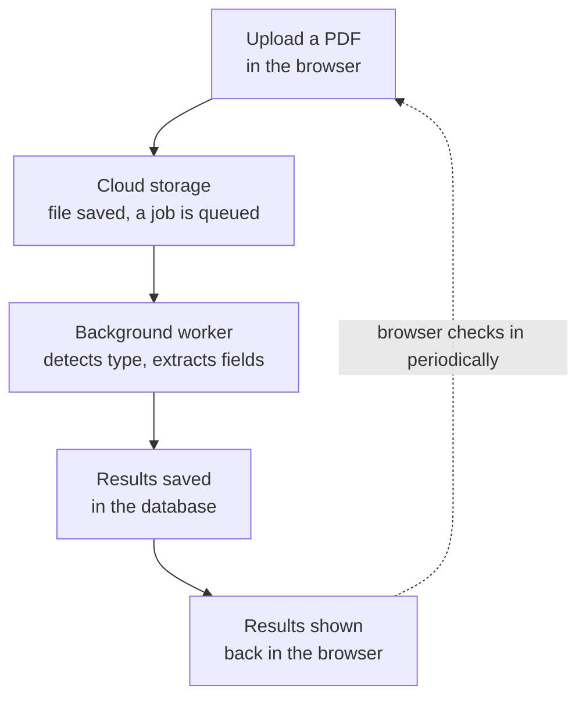

# Doc Intel Backend

A service that takes in a PDF, figures out what kind of document it is, and pulls out the fields relevant to that type — automatically, without a human reading the file or telling it what to look for.

## What it does

You upload a PDF (which may be encrypted) — that's it, no configuration needed.

Behind the scenes:

1. The file lands in cloud storage, and you immediately get back a job ID — this is an async pipeline, not an instant request/response.
2. A background worker picks it up: unlocks the PDF if needed, and breaks it into small page batches.
3. An LLM (Gemini) looks at the first batch and identifies the document type — invoice, receipt, bank statement, W2, ID document, and so on — choosing from a fixed, known list of supported types rather than free-form guessing.
4. Based on that type, the system looks up which specific Document Intelligence model to use and which fields matter for that document type, both from a database table — this is what actually decides what gets extracted, not anything typed in by the user.
5. Each page batch gets analyzed with that model, and fields get collected. **Processing stops early** as soon as every relevant field has been found — it won't keep scanning a 50-page document if the answers were on page 2.
6. The result lands in a database. Your frontend polls for it, shows the detected type and planned fields as soon as they're known, and displays the final extracted values once the job completes.

## Why it's built this way

- **Async, not synchronous** — processing can take anywhere from seconds to a couple of minutes depending on document size, so the upload request returns immediately with a job ID instead of holding the connection open.
- **Classify-then-route, driven by a database, not code** — an LLM identifies the document type, and a lookup table maps that type to a specific extraction model and its relevant fields. Adding support for a new document type is a database row, not a code change or redeploy.
- **The LLM is constrained to a known set of answers** — it can only return one of the document types the system actually knows how to handle, or an explicit fallback, so a confident-but-wrong guess can't send the pipeline down an unsupported path.
- **Batching + early exit** keeps Document Intelligence costs and processing time down — you only pay for as much of the document as you actually need.
- **A fallback model** catches anything the classifier doesn't recognize, so the pipeline degrades gracefully instead of failing outright.
- **Event-driven, not polling** — the worker is triggered by the upload itself rather than checking "is there new work?" on a timer, which is both faster and cheaper.

## Where things stand

The full pipeline works end to end: upload → cloud storage → automatic trigger → decrypt → batch → classify (Gemini) → look up fields (database) → extract → early-stop → results saved → frontend shows them. The API and frontend run continuously in Azure; the background worker currently runs locally via Docker against real cloud infrastructure during active development, and is redeployed to Azure as a containerized Function App when needed for unattended/production use.

Security scanning of uploads (malware detection before processing) is designed into the architecture but not yet switched on — every upload is currently processed regardless of a scan verdict. Turning it on is a configuration change, not a code change.

See `ARCHITECTURE.md` for a full breakdown of every component, how they connect, and the file-by-file structure of the project — including a detailed sequence diagram of exactly what happens, and who's waiting on whom, from the moment a PDF is uploaded to the moment results appear.

See `AZURE_MIGRATION.md` for the checklist used when moving the Azure infrastructure to a new account or subscription, and for pausing/resuming the more expensive pieces to control cost.